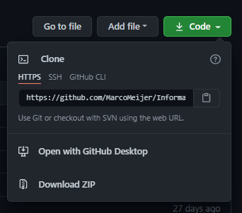
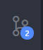
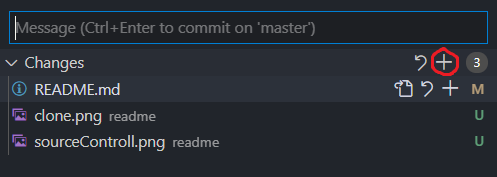
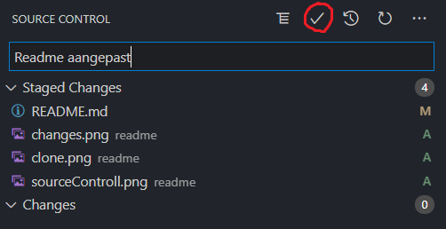
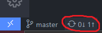

# Informatica PO

## Installatie

Om de code aan te passen zou ik VS Code gebruiken.
Dit kan je downloaden op [https://code.visualstudio.com/](https://code.visualstudio.com/).
Daarnaast heb je om de code uit te voeren yarn nodig.
Dit kan je downloaden op [https://classic.yarnpkg.com/en/docs/install/#windows-stable](https://classic.yarnpkg.com/en/docs/install/#windows-stable).
Het kan zijn dat ik iets vergeten ben dus als je foutmeldingen krijgt stuur die dan naar mij door(Marco).

Zodat we samen kunnen werken met de code heb je git nodig.
Dit kan je downloaden op [https://git-scm.com/downloads](https://git-scm.com/downloads).
Je hoeft NIET de GUI-Client te downloaden.

## Code downloaden

Om de code te downloaden moet je eerst VS code openen.
Daarna druk je op CTRL+SHIFT+P om het commando window te openen.
Daarin type je "Git: Clone" en druk je op enter.
Nu heb je de URL van de repository nodig.
Die kan je op de github pagina vinden:

In dit geval is dat [https://github.com/MarcoMeijer/InformaticaPOClient.git](https://github.com/MarcoMeijer/InformaticaPOClient.git)
Als je nu op enter drukt gaat hij als het goed is de code downloaden.

## Uitvoeren

Om het uit te voeren moet je de folder openen in VS code.
Daarna moet je op CTRL+SHIFT+` drukken om de terminal in VS code te openen.
Daarin type je:

### `yarn start`

Om het project te starten.

## Aanpasingen opslaan

Als je aanpassingen aan de code hebt gemaakt worden deze niet automatisch op github veranderd.
Je ziet dat de bestanden die je hebt aangemaakt groen zijn in VS code, en de bestanden die je hebt aangepast oranje.
Om je wijzegingen op te slaan moet je je aanpassingen "commiten".
Je drukt dan op de source controll knop link in de VS code editor.

Daarna druk je op de stage all changes knop.
Dit betekent dat je al je veranderingen wil opslaan.

Je typt er een message bij die aangeeft wat je hebt aangepast.
Bijvoorbeeld "Bug gegixed" of "Open vragen toegevoegt".
En daarna kan je op de commit knop drukken:

Je wijzigingen zijn nu gecommit, maar ze zijn nu nog niet naar github verstuurd.
Je commit staat nu alleen nog maar op je computer opgeslagen.
Om heb naar github te sturen klip je op de "push" knop links-onderin de editor:

## Available Scripts

In the project directory, you can run:

### `yarn start`

Runs the app in the development mode.\
Open [http://localhost:3000](http://localhost:3000) to view it in the browser.

The page will reload if you make edits.\
You will also see any lint errors in the console.

### `yarn test`

Launches the test runner in the interactive watch mode.\
See the section about [running tests](https://facebook.github.io/create-react-app/docs/running-tests) for more information.

### `yarn build`

Builds the app for production to the `build` folder.\
It correctly bundles React in production mode and optimizes the build for the best performance.

The build is minified and the filenames include the hashes.\
Your app is ready to be deployed!

See the section about [deployment](https://facebook.github.io/create-react-app/docs/deployment) for more information.
